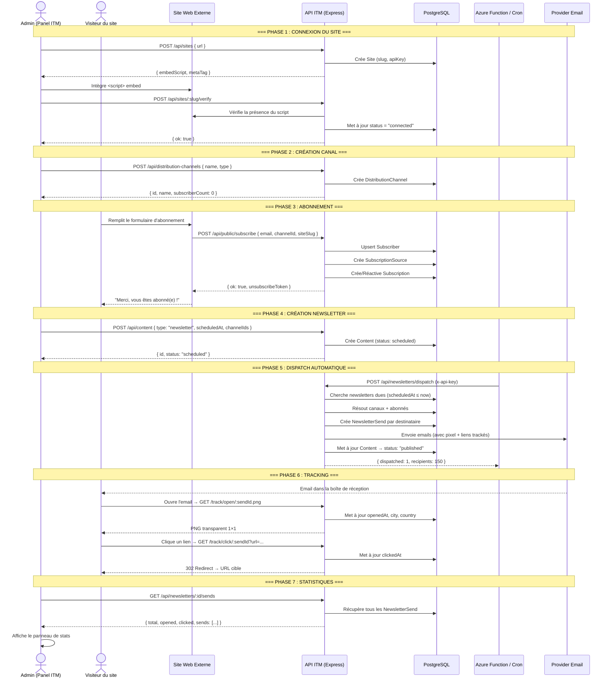

# Newsletter — Connecter la fonctionnalité à un site web existant

Ce document explique le flow complet pour lier la fonctionnalité de newsletter du panel ITM à un site web externe, étape par étape : de la connexion du site jusqu'au tracking des ouvertures.

## Table des matières

1. [Vue d'ensemble de l'architecture](#1-vue-densemble-de-larchitecture)
2. [Étape 1 — Connecter un site (Site Connect)](#2-étape-1--connecter-un-site-site-connect)
3. [Étape 2 — Créer des canaux de diffusion](#3-étape-2--créer-des-canaux-de-diffusion)
4. [Étape 3 — Intégrer un formulaire d'abonnement sur le site](#4-étape-3--intégrer-un-formulaire-dabonnement-sur-le-site)
5. [Étape 4 — Créer, planifier et envoyer une newsletter](#5-étape-4--créer-planifier-et-envoyer-une-newsletter)
6. [Étape 5 — Envoi automatique planifié (Azure Function / Cron)](#6-étape-5--envoi-automatique-planifié-azure-function--cron)
7. [Étape 6 — Tracking des ouvertures et clics](#7-étape-6--tracking-des-ouvertures-et-clics)
8. [Étape 7 — Visualisation des statistiques](#8-étape-7--visualisation-des-statistiques)
9. [Diagramme du flow complet](#9-diagramme-du-flow-complet)
10. [Modèle de données](#10-modèle-de-données)
11. [Endpoints API utiles](#11-endpoints-api-utiles)
12. [Récapitulatif des variables d'environnement](#12-récapitulatif-des-variables-denvironnement)

---

## 1. Vue d'ensemble de l'architecture

Le système de newsletter du panel ITM repose sur **7 briques interconnectées** :

```
┌────────────────────────────────────────────────────────────────────┐
│                       SITE WEB EXTERNE                             │
│  ┌──────────────┐    ┌───────────────────┐    ┌────────────────┐  │
│  │ Script embed │    │ Formulaire        │    │ <div feed>     │  │
│  │ (connect)    │    │ d'abonnement      │    │ (affichage     │  │
│  │              │    │ POST /subscribe   │    │  contenu)      │  │
│  └──────┬───────┘    └────────┬──────────┘    └────────────────┘  │
└─────────┼─────────────────────┼───────────────────────────────────┘
          │                     │
          ▼                     ▼
┌─────────────────────────────────────────────────────────────────────┐
│                      API ITM (Express, port 3001)                    │
│                                                                      │
│  /api/connect/:slug  →  Distribue le script de connexion            │
│  /api/public/subscribe →  Inscription d'un abonné                   │
│  /api/newsletters/*  →  Dispatch, envoi, tracking, stats            │
│  /api/sites/*        →  Gestion des sites connectés                 │
│  /api/track/*        →  Tracking des vues/clics sur contenu public  │
└──────────────────────────────────┬──────────────────────────────────┘
                                   │
                                   ▼
┌─────────────────────────────────────────────────────────────────────┐
│                        BASE DE DONNÉES                               │
│                                                                      │
│  Site → Content → DistributionChannel → Subscriber → Subscription   │
│                         ↓                                            │
│                   NewsletterSend (tracking)                          │
└─────────────────────────────────────────────────────────────────────┘
                                   ▲
                                   │
┌─────────────────────────────────────────────────────────────────────┐
│                  SCHEDULER (Azure Function / Cron)                   │
│                                                                      │
│  Toutes les 15 min → POST /api/newsletters/dispatch                 │
│  → Cherche les newsletters planifiées dont scheduledAt ≤ now        │
│  → Envoie les emails aux abonnés des canaux ciblés                  │
└─────────────────────────────────────────────────────────────────────┘
```

---

## 2. Étape 1 — Connecter un site (Site Connect)

**Objectif :** Enregistrer un site web dans le panel pour qu'il soit reconnu comme une source légitime de contenu et d'abonnés.

### 2.1 Ajouter un site dans le panel

Dans le panel admin (Settings → Site Connect), saisir l'URL du site :

```
https://www.monsite.com
```

Le système génère automatiquement :

| Élément | Description |
|---------|-------------|
| `slug` | Identifiant unique du site (extrait du domaine) |
| `apiKey` | Clé API unique attribuée au site |
| `embedScript` | Script JavaScript à intégrer sur le site |
| `metaTag` | Meta tag de vérification (optionnel) |

### 2.2 Intégrer le script de connexion sur le site

Copier le script généré et l'insérer dans le `<head>` de toutes les pages du site :

```html
<script src="https://api.itm.example.com/api/connect/monsite" async></script>
```

Ce script, servi dynamiquement par `GET /api/connect/:slug`, charge le connecteur ITM. Il permet au panel de vérifier que le site appartient bien au tenant et active les fonctionnalités suivantes :

- Vérification de propriété du domaine
- Activation du tracking de contenu public
- Association des abonnements à un site spécifique

### 2.3 Vérifier l'installation

Dans le panel, cliquer sur **Verify** pour le site. Le système vérifie que le script est bien présent sur le site et met à jour le statut `pending → connected`.

```typescript
// POST /api/sites/:slug/verify
// → Vérifie que le script est bien injecté et que le site est reachable
```

### Fichiers clés concernés

| Fichier | Rôle |
|---------|------|
| `src/components/site-connect-section.tsx` | UI de connexion dans les Settings |
| `server/routes/sites.ts` | Routes CRUD + vérification des sites |
| `server/controllers/sites.controller.ts` | Logique métier |
| `server/routes/connect.ts` | Distribution du script JS |
| `server/services/site.service.ts` | Service de connexion/vérification |

---

## 3. Étape 2 — Créer des canaux de diffusion

**Objectif :** Créer un ou plusieurs canaux (listes de diffusion) auxquels les visiteurs du site pourront s'abonner.

### 3.1 Créer un canal

Dans le panel, aller dans **Diffusion → Channels** et créer un canal :

```
Nom : "Newsletter Mensuelle"
Type : email
```

Un canal = une liste de diffusion. On peut en créer plusieurs (ex. "Newsletter Produit", "Annonces Partenaires", "Offres Spéciales").

### 3.2 Activer le canal

Le canal est activé par défaut (`isActive: true`). Seuls les canaux actifs reçoivent les newsletters.

### Fichiers clés concernés

| Fichier | Rôle |
|---------|------|
| `src/hooks/use-distribution-channels.ts` | Hook React pour lister/modifier les canaux |
| `src/components/channel-subscribers-drawer.tsx` | UI pour voir les abonnés d'un canal |
| `server/routes/distribution-channels.ts` | Routes API |
| `server/controllers/channels.controller.ts` | Logique métier |

---

## 4. Étape 3 — Intégrer un formulaire d'abonnement sur le site

**Objectif :** Permettre aux visiteurs du site de s'inscrire avec leur email pour recevoir les newsletters.

### 4.1 Le minimum : un champ email + un bouton

C'est ton cas d'usage. Un formulaire simple qui envoie juste l'email à l'API ITM :

```html
<!-- Copier-coller ce bloc dans ta page HTML -->
<form id="itm-subscribe">
  <input
    type="email"
    name="email"
    placeholder="votre@email.com"
    required
  />
  <button type="submit">S'abonner</button>
  <p id="itm-subscribe-msg" style="display:none"></p>
</form>

<script>
  document.getElementById('itm-subscribe').addEventListener('submit', async (e) => {
    e.preventDefault();
    const form = e.target;
    const email = form.email.value.trim();
    const msg = document.getElementById('itm-subscribe-msg');

    const res = await fetch('https://api.itm.example.com/api/public/subscribe', {
      method: 'POST',
      headers: { 'Content-Type': 'application/json' },
      body: JSON.stringify({
        email,
        channelId: 'REMPLACER_PAR_ID_DU_CANAL', // ← à récupérer dans le panel (étape 2)
      }),
    });

    msg.style.display = 'block';
    if (res.ok) {
      msg.textContent = 'Merci ! Vous êtes abonné(e).';
      msg.style.color = 'green';
      form.reset();
    } else {
      const data = await res.json();
      msg.textContent = data.error || 'Erreur lors de l\'inscription.';
      msg.style.color = 'red';
    }
  });
</script>
```

### 4.2 Les seuls champs à connaître

| Champ | Obligatoire | Description |
|-------|:----------:|-------------|
| `email` | ✅ | L'email du visiteur |
| `channelId` | ✅ | L'ID du canal de diffusion créé dans le panel (étape 2) |
| `name` | | Le prénom/nom du visiteur (optionnel, mais utile pour personnaliser les emails) |
| `siteSlug` | | Le slug du site connecté (étape 1). Recommandé pour tracer la provenance. |

### 4.3 Variante avec le prénom (recommandé)

Ajouter un champ `name` permet de personnaliser les newsletters ("Bonjour Jean") et d'afficher le nom dans les stats d'ouverture :

```html
<form id="itm-subscribe">
  <input type="text" name="name" placeholder="Votre prénom" />
  <input type="email" name="email" placeholder="votre@email.com" required />
  <button type="submit">S'abonner</button>
</form>
<!-- le script est identique, il suffit d'ajouter name dans le body -->
```

Dans le `fetch`, ajouter `name` :

```javascript
body: JSON.stringify({
  email,
  name: form.name.value.trim() || null,
  channelId: 'REMPLACER_PAR_ID_DU_CANAL',
}),
```

### 4.4 Ce qui se passe côté serveur

1. **`POST /api/public/subscribe`** reçoit `{ email, channelId }`.
2. La fonction `subscribe()` dans `subscribe.controller.ts` :
   - Vérifie que le canal existe.
   - Crée ou met à jour le `Subscriber` (upsert par `tenantId + email`).
   - Crée la `Subscription` qui lie l'abonné au canal.
   - Génère un `unsubscribeToken` pour le lien de désabonnement.
3. Renvoie `{ ok: true }`.
4. Si l'email est déjà abonné, il est simplement réactivé (pas d'erreur).

### 4.5 Lien de désabonnement

Chaque email de newsletter contient automatiquement un lien de désabonnement :

```
https://api.itm.example.com/api/public/unsubscribe?token=<unsubscribeToken>
```

Ce endpoint (`GET /api/public/unsubscribe`) désactive toutes les souscriptions de l'abonné.

### Fichiers clés concernés

| Fichier | Rôle |
|---------|------|
| `server/routes/subscribe.ts` | Routes publiques subscribe/unsubscribe |
| `server/controllers/subscribe.controller.ts` | Logique d'abonnement/désabonnement |

---

## 5. Étape 4 — Créer, planifier et envoyer une newsletter

### 5.1 Créer une newsletter dans le panel

Dans le panel admin, créer un nouveau contenu de type **Newsletter** :

1. Rédiger le sujet et le corps (Markdown + sections visuelles).
2. Sélectionner un template (optionnel).
3. Choisir le(s) canal(aux) de diffusion cible(s).
4. Définir une date de planification (`scheduledAt`).

### 5.2 Envoi immédiat (manuel)

Pour envoyer immédiatement, cliquer sur **Send** dans le panel. Cela appelle :

```typescript
// POST /api/newsletters/:id/send  (authentifié)
```

Le service `sendNewsletterById()` dans `newsletter.service.ts` :

1. Récupère le contenu et ses métadonnées.
2. Résout les canaux cibles et leurs abonnés actifs.
3. Rend le HTML de la newsletter (Markdown → HTML, sections, images signées Azure).
4. Crée un enregistrement `NewsletterSend` par abonné.
5. Envoie l'email via le provider configuré (SMTP, SendGrid, etc.).
6. Met à jour le statut du contenu : `scheduled → published`.
7. Injecte un pixel de tracking (ouverture) et réécrit les liens (clic) :

```html
<!-- Pixel de tracking d'ouverture -->
.png"
     width="1" height="1" alt="" />

<!-- Lien tracké -->
<a href="https://api.itm.example.com/api/newsletters/track/click/<sendId>?url=https://example.com">
  Cliquez ici
</a>
```

### 5.3 Envoi automatique (planifié)

Si la newsletter est planifiée (`scheduledAt` dans le futur, statut `scheduled`), l'envoi est déclenché par le scheduler — voir étape 5.

### Fichiers clés concernés

| Fichier | Rôle |
|---------|------|
| `src/components/newsletter-sends-panel.tsx` | Panel de statistiques par newsletter |
| `src/components/create-publication-composer.tsx` | Composeur de contenu (interface de création) |
| `src/hooks/use-content.ts` | Hooks React (useSendNewsletter, etc.) |
| `server/services/newsletter.service.ts` | Service d'envoi (cœur de la logique métier) |
| `server/controllers/newsletter.controller.ts` | Contrôleur (dispatch, sendOne, tracking) |
| `server/routes/newsletters.ts` | Routes API newsletter |

---

## 6. Étape 5 — Envoi automatique planifié (Azure Function / Cron)

**Objectif :** Déclencher automatiquement l'envoi des newsletters dont la date planifiée est atteinte.

### 6.1 Fonction Azure (recommandé)

Une Azure Function Timer se déclenche toutes les 15 minutes :

```typescript
// azure-functions/newsletter-dispatch/src/functions/newsletterDispatch.ts

const SCHEDULE = process.env.DISPATCH_CRON ?? '0 */15 * * * *'; // toutes les 15 min

app.timer('newsletterDispatch', {
  schedule: SCHEDULE,
  handler: async (_myTimer, context) => {
    const url = `${process.env.API_BASE_URL}/api/newsletters/dispatch`;
    const res = await fetch(url, {
      method: 'POST',
      headers: { 'x-api-key': process.env.PUBLIC_API_KEY },
    });
    // ...
  },
});
```

Elle appelle `POST /api/newsletters/dispatch` avec la clé API publique.

### 6.2 Alternative : Cron externe

Si Azure Functions n'est pas utilisé, configurer un cron (crontab, Render Cron Job, GitHub Actions, etc.) qui appelle le même endpoint :

```bash
# Toutes les 15 minutes
*/15 * * * * curl -X POST https://api.itm.example.com/api/newsletters/dispatch \
  -H "x-api-key: <PUBLIC_API_KEY>"
```

### 6.3 Ce qui se passe côté serveur

La fonction `dispatchDueNewsletters()` (dans `newsletter.service.ts`) :

1. Cherche tous les contenus `newsletter` avec un `scheduledAt ≤ now` et un statut `scheduled | approved | published`.
2. Résout les canaux associés (`ContentChannel`).
3. Pour chaque newsletter due, exécute `dispatchItem()` :
   - Rend le HTML.
   - Récupère les abonnés actifs des canaux cibles.
   - Vérifie qu'elle n'a pas déjà été envoyée (`alreadySent`).
   - Crée les `NewsletterSend` et envoie les emails.
   - Passe le contenu en statut `published`.

### Fichiers clés concernés

| Fichier | Rôle |
|---------|------|
| `azure-functions/newsletter-dispatch/src/functions/newsletterDispatch.ts` | Azure Function timer |
| `azure-functions/newsletter-dispatch/README.md` | Doc de déploiement |
| `server/routes/newsletters.ts` (ligne 9) | Route `/dispatch` protégée par API key |
| `server/services/newsletter.service.ts` | `dispatchDueNewsletters()` |

---

## 7. Étape 6 — Tracking des ouvertures et clics

### 7.1 Tracking d'ouverture

Chaque email contient un pixel invisible :

```html
.png"
     width="1" height="1" alt="" />
```

Quand le destinataire ouvre l'email, son client mail charge l'image, ce qui déclenche :

```
GET /api/newsletters/track/open/:sendId.png
```

La fonction `trackOpen()` :

1. Vérifie que le `sendId` existe et n'a pas déjà été ouvert.
2. Récupère la géolocalisation via l'IP du destinataire.
3. Met à jour le `NewsletterSend` : `openedAt`, `city`, `country`, `ipAddress`, `userAgent`.
4. Recalcule les taux d'ouverture/clic du contenu associé.
5. Renvoie un PNG transparent 1×1.

### 7.2 Tracking de clic

Les liens dans l'email sont réécrits :

```html
<a href="https://api.itm.example.com/api/newsletters/track/click/<sendId>?url=https://example.com">
```

Quand le destinataire clique :

```
GET /api/newsletters/track/click/:sendId?url=https://example.com
```

La fonction `trackClick()` :

1. Enregistre le clic (`status: 'clicked'`, `clickedAt`, et `openedAt` si pas déjà ouvert).
2. Récupère la géolocalisation.
3. Redirige (302) vers l'URL cible.

### 7.3 Tracking de vues sur le site (script embed)

Le script de connexion injecté sur le site permet aussi de tracker les vues/lectures de contenu public affiché via les balises `<div data-itm-feed>`.

```
POST /api/track/view   →  Incrémente le compteur de vues
POST /api/track/click  →  Incrémente le compteur de clics
```

### Fichiers clés concernés

| Fichier | Rôle |
|---------|------|
| `server/controllers/newsletter.controller.ts` (lignes 70-130) | `trackOpen()` et `trackClick()` |
| `server/controllers/tracking.controller.ts` | Tracking public (vues/clics sur site) |
| `server/routes/newsletters.ts` (lignes 18-19) | Routes de tracking publiques |
| `server/routes/tracking.ts` | Routes de tracking site |

---

## 8. Étape 7 — Visualisation des statistiques

Dans le panel, pour chaque newsletter envoyée, un panneau latéral affiche :

- **Nombre d'envois** : total des destinataires.
- **Taux d'ouverture** : combien ont ouvert.
- **Taux de clic** : combien ont cliqué.
- **Localisation** : ville/pays des destinataires ayant ouvert.
- **Détail par destinataire** : nom, email, heure d'ouverture, ville, pays.

L'appel API est :

```
GET /api/newsletters/:contentId/sends  (authentifié)
```

Réponse :

```json
{
  "contentId": "clx...",
  "total": 150,
  "opened": 67,
  "clicked": 12,
  "sends": [
    {
      "id": "send_...",
      "status": "opened",
      "email": "jean@example.com",
      "name": "Jean Dupont",
      "city": "Paris",
      "country": "France",
      "openedAt": "2026-07-15T10:30:00.000Z",
      "clickedAt": null,
      "createdAt": "2026-07-15T10:00:00.000Z"
    }
  ]
}
```

### Fichiers clés concernés

| Fichier | Rôle |
|---------|------|
| `src/components/newsletter-sends-panel.tsx` | UI du panneau de stats |
| `src/hooks/use-content.ts` (lignes 172-182) | `useNewsletterSends()` |
| `server/controllers/newsletter.controller.ts` (lignes 132-174) | `listSends()` |

---

## 9. Diagramme du flow complet



---

## 10. Modèle de données

Voici les tables Prisma concernées par le flux newsletter :

```
┌───────────────────┐       ┌────────────────────────┐
│       Site        │       │   DistributionChannel   │
│───────────────────│       │────────────────────────│
│ id (PK)           │       │ id (PK)                │
│ slug (UNIQUE)     │       │ name                   │
│ name              │       │ type (email/web/...)   │
│ url               │       │ subscriberCount        │
│ apiKey (UNIQUE)   │       │ isActive               │
│ status            │       │ tenantId (FK→Workspace)│
│ tenantId          │       │ lastSentAt             │
│ verifiedAt        │       └───────────┬────────────┘
└─────────┬─────────┘                   │
          │                             │
          │  ┌──────────────────────────┼──────────────────────┐
          │  │                          │                      │
          │  │                 ┌────────┴────────┐    ┌───────┴──────────┐
          │  │                 │  Subscription   │    │ SubscriptionSource│
          │  │                 │─────────────────│    │──────────────────│
          │  │                 │ id (PK)         │    │ id (PK)          │
          │  │                 │ subscriberId(FK)│───▶│ tenantId         │
          │  │                 │ sourceId (FK)   │    │ siteId (FK→Site) │
          │  │                 │ channelId (FK)  │    │ channelId (FK)   │
          │  │                 │ status          │    │ formKey          │
          │  │                 └────────┬────────┘    │ type             │
          │  │                          │             └──────────────────┘
          │  │                          │
          ▼  ▼                          ▼
┌───────────────────┐       ┌───────────────────┐
│     Content       │       │    Subscriber     │
│───────────────────│       │───────────────────│
│ id (PK)           │       │ id (PK)           │
│ type (newsletter) │       │ email             │
│ title             │       │ name              │
│ body              │       │ tenantId          │
│ status            │       │ status            │
│ tenantId          │       │ unsubscribeToken  │
│ siteId (FK→Site)  │       └───────────────────┘
│ scheduledAt       │
│ publishedAt       │
│ metadata (JSON)   │
└─────────┬─────────┘
          │
          ▼
┌───────────────────────┐
│   NewsletterSend      │
│───────────────────────│
│ id (PK)               │
│ contentId (FK)        │
│ subscriberId (FK)     │
│ channelId             │
│ status (sent/opened/  │
│         clicked/...)  │
│ openedAt              │
│ clickedAt             │
│ ipAddress             │
│ city                  │
│ country               │
│ userAgent             │
└───────────────────────┘
```

---

## 11. Endpoints API utiles

### Endpoints publics (accessibles depuis le site web)

| Méthode | Endpoint | Description | Auth |
|---------|----------|-------------|------|
| `GET` | `/api/connect/:slug` | Script de connexion JS | Aucune |
| `POST` | `/api/public/subscribe` | Abonnement à un canal | Aucune |
| `GET` | `/api/public/unsubscribe?token=` | Désabonnement | Token |
| `GET` | `/api/public/content?site=` | Contenu publié d'un site | Aucune |
| `GET` | `/api/newsletters/track/open/:sendId.png` | Pixel d'ouverture | Aucune |
| `GET` | `/api/newsletters/track/click/:sendId?url=` | Tracking de clic | Aucune |

### Endpoints admin (authentifiés par session)

| Méthode | Endpoint | Description |
|---------|----------|-------------|
| `GET` | `/api/sites?tenantId=` | Lister les sites connectés |
| `POST` | `/api/sites` | Connecter un nouveau site |
| `POST` | `/api/sites/:slug/verify` | Vérifier l'installation |
| `GET` | `/api/distribution-channels?tenantId=` | Lister les canaux |
| `POST` | `/api/distribution-channels` | Créer un canal |
| `PATCH` | `/api/distribution-channels/:id` | Modifier un canal |
| `GET` | `/api/subscribers?channelId=` | Abonnés d'un canal |
| `GET` | `/api/subscribers/count?tenantId=` | Nombre total d'abonnés |
| `POST` | `/api/newsletters/:id/send` | Envoyer une newsletter immédiatement |
| `GET` | `/api/newsletters/:id/sends` | Statistiques d'envoi |

### Endpoint scheduler (protégé par API key)

| Méthode | Endpoint | Description |
|---------|----------|-------------|
| `POST` | `/api/newsletters/dispatch` | Dispatch automatique des newsletters planifiées |

---

## 12. Récapitulatif des variables d'environnement

| Variable | Description | Exemple |
|----------|-------------|---------|
| `PUBLIC_API_KEY` | Clé API publique pour dispatch + tracking | `sk-1234567890abcdef` |
| `API_BASE_URL` | URL publique de l'API (pour Azure Function) | `https://api.itm.example.com` |
| `DISPATCH_CRON` | Fréquence de dispatch (NCRONTAB) | `0 */15 * * * *` |
| `APP_URL` | URL de l'app (pour les liens dans les emails) | `https://app.itm.example.com` |
| `DATABASE_URL` | Connexion PostgreSQL | `postgresql://...` |
| `AZURE_STORAGE_CONNECTION_STRING` | Stockage des images de newsletter | `DefaultEndpointsProtocol=https;...` |

---

## Checklist de mise en place

- [ ] **1.** Connecter le(s) site(s) dans Settings → Site Connect
- [ ] **2.** Intégrer le `<script>` embed sur toutes les pages du site
- [ ] **3.** Vérifier l'installation (bouton Verify)
- [ ] **4.** Créer un ou plusieurs canaux de diffusion (Distribution Channels)
- [ ] **5.** Ajouter un formulaire d'abonnement sur le site (`POST /api/public/subscribe`)
- [ ] **6.** Configurer le provider email (SMTP, SendGrid, etc.)
- [ ] **7.** Déployer l'Azure Function (ou configurer un cron externe)
- [ ] **8.** Créer une première newsletter test dans le panel
- [ ] **9.** Envoyer en mode manuel pour valider le rendu
- [ ] **10.** Planifier une newsletter et vérifier le dispatch automatique
- [ ] **11.** Vérifier les statistiques d'ouverture/clic
- [ ] **12.** Tester le lien de désabonnement
